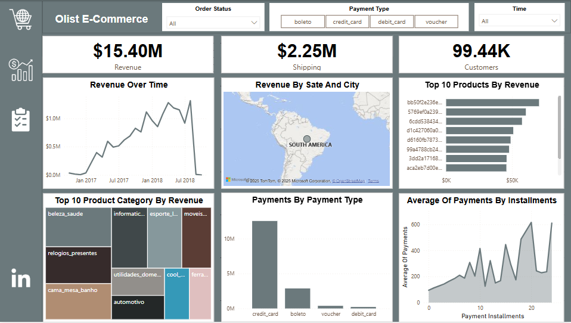
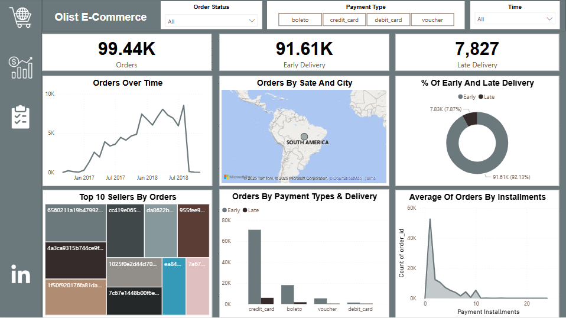

# Olist_E-commerce

## Introduction

### Overview

This user story outlines the specifications for building a dashboard using Power BI to help Olist e-commerce show the sales performance between 2016 and 2018.

### Key Questions/Objectives

Show two dashboards that make an analysis for the revenue and orders between 2016 and 2018.

### Target Audience

The audience in this project is the sales manager.

Summary of Findings
  
  • Overall Revenue is 15.4 million.
  
  • The number of orders is 99.44 thousand.
  
  • The number of customers is 99.44 thousand.
  
  • There were 91.61 thousand early orders and 7.82 thousand late orders

## Data Source & Description

### Data Origin

The dataset is coming from an open-source dataset on Kaggle in 9 csv files [see here to find it.](https://www.kaggle.com/datasets/olistbr/brazilian-ecommerce/data).

### Data Structure

Nine structured tables shown in csv files.

### Initial Data Quality Assessment

I observed many unnecessary columns on almost each table.

## Data Cleaning & Processing

### Handling Missing Values

In orders table there were 610 missing values in delivered date and time column, and for that we decided to fill them with the estimated delivery time minus a day.

## Removing Duplicate rows

In the geolocation table there were 261831 duplicate rows that we had to remove.

## Data Type Conversions

Change order_purchase_timestamp, order_delivered_customer_date, order_estimated_delivery_date, shipping_limit_date, review_creation_date, review_answer_timestamp columns from object to Datestamp.

## Data Transformation

Derived a new column in order items table called revenue that calculated from order item * price.

## Removing unnecessary columns
There were so many unnecessary columns that we decided to remove like

  • (customer_unique_id, customer_city, customer_state) in customers’ table.
  
  • (order_approved_at, order_delivered_carrier_date) in orders’ table.
  
  • (product_name_lenght, product_description_lenght, product_photos_qty, product_weight_g, product_length_cm, product_height_cm, product_width_cm) in products’ table.
  
  • (seller_city, seller_state) in sellers’ table.
  
  • (review_comment_title, review_comment_message) on reviews’ table.

## Dashboard Development

### Revenue Report | Requirements

#### Report Objective

The purpose of this report is to present an analysis of revenue through an overview of the revenue over time and show what is the most profitable categories.

#### Key Requirements

#### KPI Overview

Display a summary of revenue, shipping value and customers.

#### Revenue Over Time

Present the data for revenue over time in a line chart.

#### Revenue By State & City

Display overall revenue by state and city in a map.

#### Top 10 Products by Revenue

Present top 10 products that made revenue in a bar chart.

#### Top 10 Product Category by Revenue

Show top 10 product categories by revenue in a treemap.

#### Show How Many Payments Made in Each Payment Type

In a column chart, display the payments made by each payment type.

#### Average Payments by Each Installment

Display an area chart that shows the average payments by payment installments.

### Orders Report | Requirements

#### Orders Purpose

The purpose of this report is to present an analysis of orders through an overview of the number of orders overtime and show if the orders were delivered on the date.

#### Key Requirements

#### KPI Overview

Display a summary of orders, early and late deliveries.

#### Orders Over Time

Present the data for the number of orders overtime in a line chart.

#### Orders By State & City

Display overall orders by state and city in a map.

#### Percentage of Early & Late Deliveries

Present % of early and late deliveries in a nice pie chart.

#### Top 10 Sellers by Orders

Show top 10 sellers by number of orders in a treemap.

#### Show How Many Orders Made in Each Payment Type & Delivery Status

In a clustered column chart, display the orders made by each payment type and delivery status.

#### Average orders by Each Installment

Display an area chart that shows the average orders by payment installments.

## Conclusion

  • The highest revenue made in September 2018.

  • The highest orders also made in September 2018.

  • Percentage of early deliveries was 92.1% which needed to be better.

  • The most profitable category is beauty health.

  • The most used payment type is credit card.

  • The average of payments is increasing with the payment installment.

